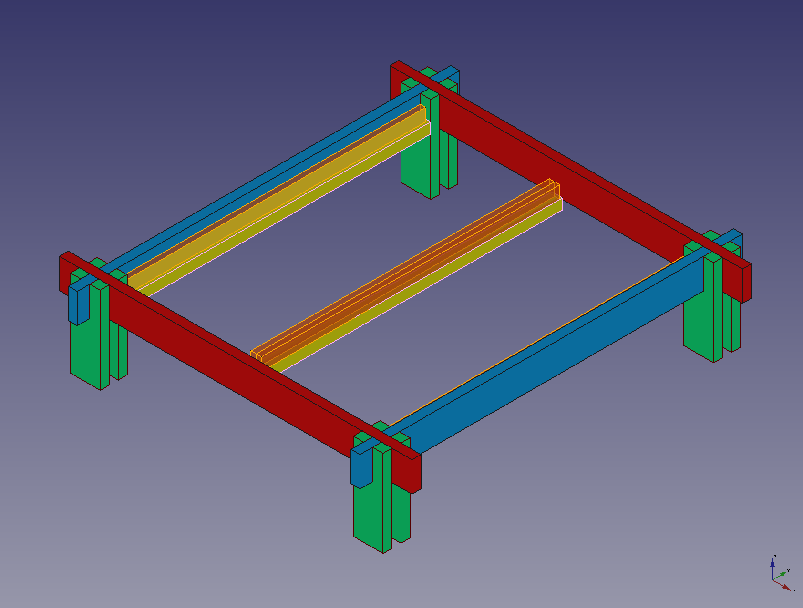

# Stage Bed :metal:

 This work is licensed under a <a rel="license" href="http://creativecommons.org/licenses/by/4.0/">Creative Commons Attribution 4.0 International License</a>.

This is a frame for the bed that [Leni][leni] and I designed and built with the
help of [Clément][clement] who you should hire if you need any dope stuff built
in Berlin :bear: :de:. The panelling work is not included in these drafts. The
design objective was to create a bed that could double as a set for photoshoots
or a stage for pillow fights or bedroom concerts :sunglasses:. Leni just walked
into the cafe where I'm publishing this and the first thing she mentioned is
how she can store her entire life beneath the mattress so yeah... I guess it
serves a pretty niftly storage unit as well. We built a version with slightly
higher pillars and I guess a great percentage of humans can sit upright or
comfortably crawl under the mattress.

Here is a picture of Leni posing on a version of the bed. I have to credit
Clément for the build quality and stellar paint-job.

A [plan][plan] of the components required is provided in [docs/plan.pdf][plan]

## Parameters

The model has been parameterized to allow the changing of the dimensions of the
model by simply altering the values in the Dimensions table within the FreeCAD
project.

> Some components may require repositioning if values in this table are
> modified.

| Section | Dimension | Description |
|----|----|----|
| `Mattress` | `length` | Length of the mattress|
| `Mattress` | `width` | Width of the mattress|
| `Mattress` | `height` | Height of the mattress|
| `Mattress` | `radius` | Radius in the rounding of the mattress corners|
| `Slat supports` | `Slat width` | Width of one the edge slat of the Lattenrost | 
| `Slat supports` | `Slat height` | Height of the one edge slat of the Lattenrost |
| `Slat supports` | `slat_foundation_side` | Width of the support that carries the slats of the Lattenrost |
| `Beams` | `width` | Width of the beams used to create the top-facing support lattice |
| `Beams` | `height` | Height of the beams used to create the top-facing support lattice |
| `Beams` | `groove` | Height of the groove used to interlock the beams in the top-facing support lattice |
| `Loadbearer` | `length` | Length of the beams used for top-facing surface |
| `Loadbearer` | `height` | Height of the beams used for the top-facing surface (same as `Beams` / `height`) |
| `Loadbearer` | `width` | Width of the beams used for the top-facing surface (same as `Beams` / `width`) |
| `Pillars` | `height` | I dunno :expressionless: |
| | `seat_height` | The height of the sitting surface |
| | `seat_width` | The width of the sitting edge around the mattress |

[plan]: ./docs/plan.pdf
[leni]: https://instagram.com/lenipaperboats
[clement]: https://instagram.com/clecledontplayplay
